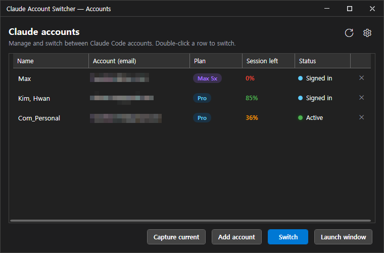
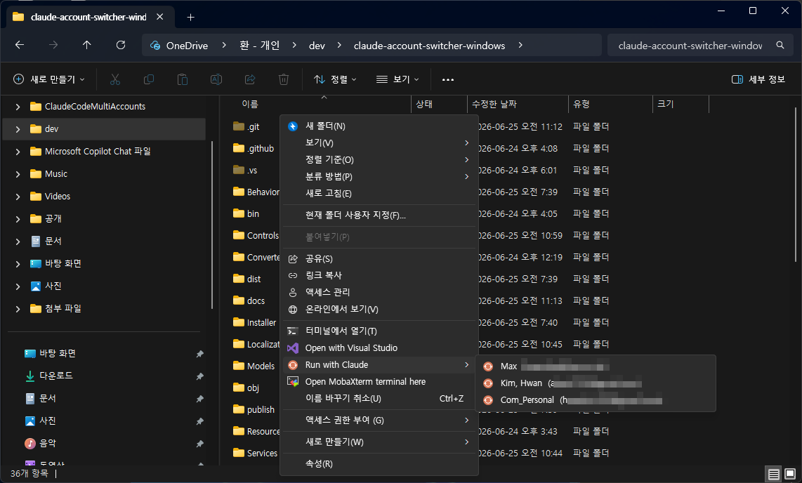
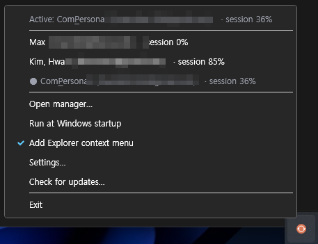
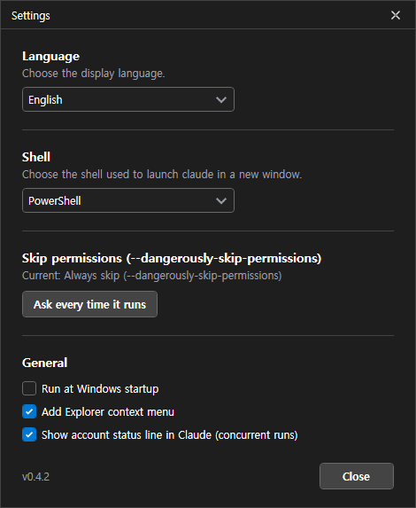

# Claude Account Switcher

> 여러 **Claude Code(CLI)** 계정을 Windows에서 전환·동시 실행 — 시스템 트레이에서.

*[English README](README.md)*

[](https://github.com/akon47/claude-account-switcher-windows/releases/latest)
[](https://github.com/akon47/claude-account-switcher-windows/releases)

[](LICENSE)

<p align="center">
  
</p>

**Claude Account Switcher**는 Windows 시스템 트레이에 상주하며 여러 Claude Code(CLI) 로그인
계정을 관리합니다. 각 계정은 격리된 *프로필*로 보관되어, 활성 계정을 클릭 한 번으로 바꾸거나
여러 계정을 동시에 병렬로 사용할 수 있습니다.

## 무엇을 하나요

- **전환 (Switch)** — 저장된 계정을 클릭 한 번으로 활성 계정으로. 평소 쓰는 `claude` 명령이
  바로 그 계정으로 동작합니다.
- **동시 실행 (Concurrent)** — 계정마다 격리된 설정 폴더를 두고, 여러 터미널에서 서로 다른
  계정을 충돌 없이 동시에 사용합니다.

## 어떻게 동작하나요

Claude Code는 로그인 정보를 `~/.claude/.credentials.json`(OAuth 토큰)에, 계정 정보(이메일·플랜
등)를 `~/.claude.json`의 `oauthAccount`에 저장합니다. 이 앱은 이를 프로필별로 보관합니다.

- **전환**: 선택한 프로필의 `.credentials.json`을 `~/.claude/`로 복사하고, `~/.claude.json`의
  `oauthAccount`도 그 계정으로 패치해 `claude /status`가 올바른 계정을 표시하게 합니다.
  (전환 전 현재 자격증명을 백업하고, 떠나는 계정에는 갱신된 토큰을 되돌려 저장)
- **동시 실행**: 새 터미널을 `CLAUDE_CONFIG_DIR=<프로필 폴더>`로 띄웁니다. `~/.claude`를 건드리지
  않으므로 계정 간 충돌이 없습니다.

프로필 데이터는 `%APPDATA%\ClaudeAccountSwitcher\`에 저장됩니다. (저장소에는 포함되지 않음)

## 기능

- 시스템 트레이 상주, 다크 테마 UI, 커스텀 타이틀바.
- 현재 로그인 계정 캡처, 새 계정 추가(격리 로그인), 전환, 이름 변경, 삭제.
- 선택한 폴더에서 프로필을 새 터미널로 실행.
- **세션 사용량 한눈에** — 계정마다 5시간 세션의 남은 한도와 리셋까지 남은 시간을 표시합니다.
  **주간 한도가 소진**되면 **0%**와 주간 리셋까지 남은 시간을 보여줍니다(주간이 소진되면 5시간 창이
  100%여도 실제로는 쓸 수 없으므로).
- **세션 자동 유지**(계정별 토글) — 계정의 5시간 창이 리셋되는 즉시 창 없이 한마디를 보내 새 창을
  곧바로 시작시킵니다(트레이 앱이 상주 중일 때 동작).
- **계정 간 세션 이어하기** — 특정 계정의 지난 Claude Code 대화 세션을 훑어보고, *다른* 계정으로
  이어서 진행할 수 있습니다(사본으로 열려 원본은 그대로 보존).
- **계정 상태줄** — 동시 실행 시 claude 하단에 계정 이메일 · 플랜 · 이름 · 실시간 세션% 를 표시.
- **실행 옵션**: **PowerShell / cmd** 선택, `--dangerously-skip-permissions` 부여 여부 선택
  (*다시 묻지 않음*으로 선택값 기억 — **설정**에서 언제든 재설정). 탐색기 우클릭 실행에도 적용됩니다.
- 탐색기 우클릭 **"Claude로 실행"** 서브메뉴(계정별, 선택).
- Windows 시작 시 자동 실행(선택).
- **자동 업데이트** — 시작 시(그리고 트레이 메뉴에서 직접) GitHub Releases를 확인해 새 버전 설치를 제안.
- **14개 UI 언어** — Windows 표시 언어에 맞춰 자동 선택(English, 한국어, 日本語, 简体中文, 繁體中文,
  Español, Français, Deutsch, Português, Русский, Italiano, Türkçe, Tiếng Việt, Bahasa Indonesia).
  각 언어는 런타임에 탐색되는 `Localization/<culture>.json` 한 파일 — JSON만 추가하면 언어 확장.

## 스크린샷

탐색기에서 폴더를 우클릭 → **Claude로 실행** → 계정 선택. 전환 없이 그 폴더에서 선택한 계정으로
`claude`가 실행되는 새 터미널이 열립니다:



<p align="center">
  
  &nbsp;&nbsp;
  
</p>

<p align="center"><sub>트레이 메뉴(빠른 전환 · 토글) · 설정</sub></p>

## 설치

### winget

```powershell
winget install akon47.ClaudeAccountSwitcher
```
*[winget-pkgs](https://github.com/microsoft/winget-pkgs)에 등록 PR이 검토 중 — 머지되면 동작합니다.*

### 인스톨러

[Releases](https://github.com/akon47/claude-account-switcher-windows/releases)에서
`Claude-Account-Switcher-Setup_vX.Y.Z.exe`를 받아 실행하세요. 자기완결·현재 사용자 설치
(`%LOCALAPPDATA%\Programs`, 관리자 불필요, ~55MB).

## 소스 빌드

**.NET 9 SDK** 필요. 인스톨러 빌드에는 NSIS(`makensis`)가 추가로 필요합니다.

```powershell
dotnet build Claude-Account-Switcher.csproj -c Debug     # 빌드
dotnet run --project Claude-Account-Switcher.csproj      # 실행(트레이)
powershell Installer\build-installer.ps1                 # 인스톨러 빌드 -> dist\Claude-Account-Switcher-Setup.exe
```

## 릴리스 (메인테이너)

릴리스는 GitHub Actions로 자동화돼 있습니다:

- **`build`** — `main` 푸시/PR마다 컴파일 검증.
- **`bump-version`**(수동) — csproj `<Version>`을 올리고 커밋 + `vX.Y.Z` 태그 푸시.
- **`release`** — `vX.Y.Z` 태그가 올라오면 자기완결 인스톨러를 빌드해 GitHub Release로 게시.
- **`winget`** — 릴리스 공개 시 `microsoft/winget-pkgs`로 업데이트 PR 자동 생성
  (저장소 변수 `PUBLISH_WINGET=true` + 시크릿 `WINGET_TOKEN` 필요. [`winget/README.md`](winget/README.md) 참고).

릴리스하려면: **bump-version**을 새 버전으로 실행(또는 직접 `vX.Y.Z` 태그 푸시).

## 기술 스택

- .NET 9 / WPF (Windows 전용), MVVM(`Microsoft.Extensions.DependencyInjection` +
  `CommunityToolkit.Mvvm`).
- 자체 디자인 다크 테마; 시스템 트레이는 `H.NotifyIcon.Wpf`.

## 보안 참고

Claude Code 자체가 Windows에서 `.credentials.json`을 평문으로 저장합니다. 이 앱도 동일한 수준으로
계정별 자격증명을 사용자 프로필 폴더(`%APPDATA%`)에 보관합니다. 향후 DPAPI 기반 암호화 저장을 검토합니다.

## 면책 고지

이 프로젝트는 **비공식·독립 도구**이며 **Anthropic과 제휴·후원·보증 관계가 없습니다**.
"Claude", "Claude Code"는 각 권리자의 상표입니다.

이 앱은 **사용자가 정당하게 보유한 계정**을 본인 PC에서 로컬 자격증명 파일 복사와 환경변수 설정으로
관리할 뿐, 인증이나 기술적 보호조치를 우회하지 않습니다. 추가하는 각 계정을 해당 서비스의 이용약관·
사용정책(계정 공유 제한, 사용량/레이트 리밋 우회 금지 등)에 맞게 사용할 책임은 사용자에게 있습니다.
사용에 따른 책임은 사용자에게 있으며, 본 소프트웨어는 어떠한 보증도 없이 "있는 그대로" 제공됩니다
([MIT](LICENSE) 참고).

## 라이선스

[MIT](LICENSE)
